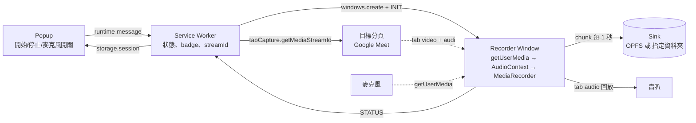
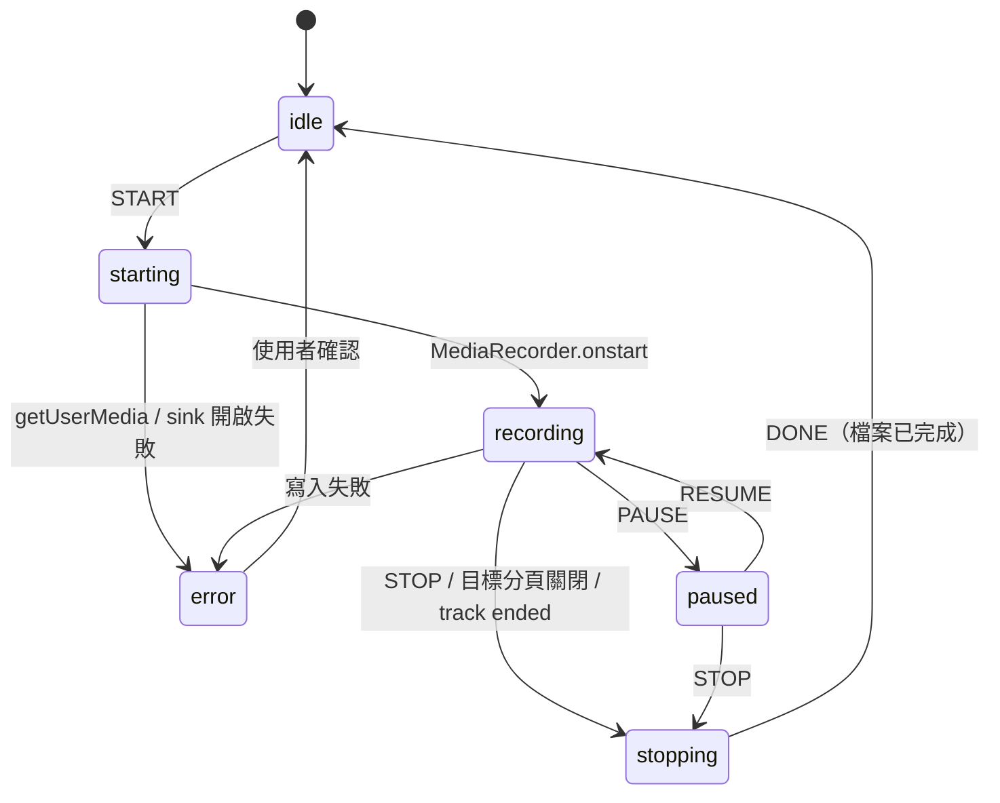
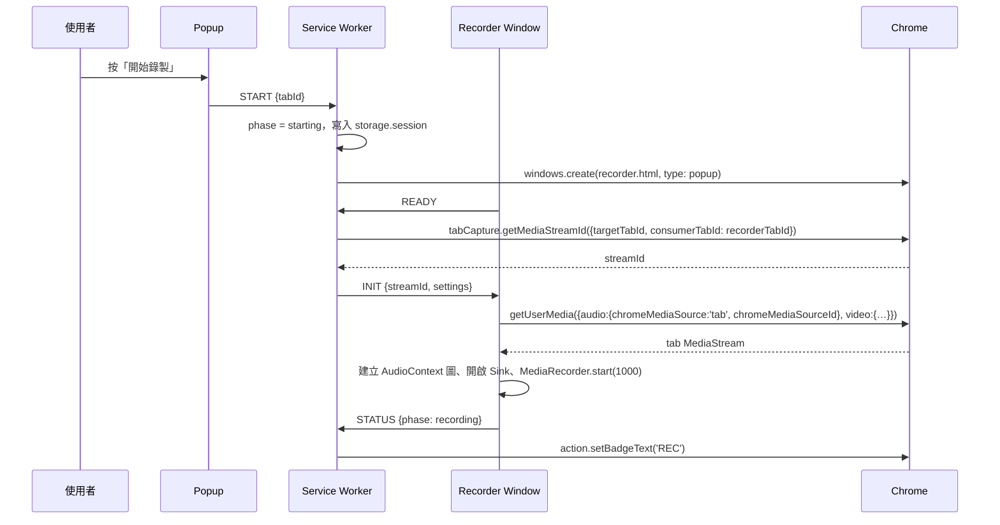
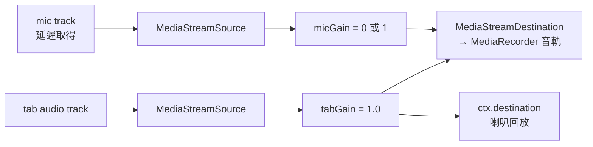
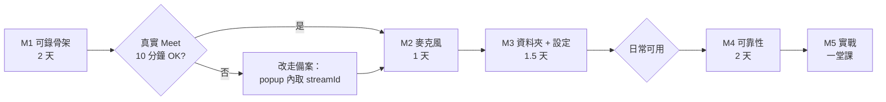

# Tab Recorder Chrome Extension — Implementation Plan

Sep 26, 2026 · @Wayne

> 文件版本：v1.3（2026-09-26）。版本歷程見 [CHANGELOG](CHANGELOG.md)。

## 1. 決策摘要與架構影響

五項決策已定案，其中「可指定資料夾」與「麥克風隨時開關」兩項直接決定了架構：錄製引擎必須跑在一個可見的 extension 視窗，而不是 offscreen document。

| 決策 | 選擇 | 對架構的影響 |
| --- | --- | --- |
| 擷取方式 | `chrome.tabCapture` 一鍵錄分頁 | 需要 `tabCapture` + `activeTab` 權限；串流 ID 由 service worker 取得後交給錄製頁面消費 |
| 輸出格式 | WebM（VP9/VP8 + Opus） | 用 `MediaRecorder`，不需 WebCodecs；但必須就地修補 Duration，否則檔案無法拖曳進度 |
| 麥克風 | 動態選項，錄製中可隨時開關 | 音訊必須經過 `AudioContext` 混音，靠 GainNode 切換；`MediaRecorder` 的音軌從頭到尾不變 |
| 儲存位置 | 可指定資料夾，預設下載資料夾 | 需要 File System Access API 的 `showDirectoryPicker`，只能在可見視窗且有使用者手勢時呼叫 → 錄製引擎改跑在 Recorder Window |
| 使用範圍 | 純個人使用 | 以「載入未封裝擴充功能」安裝，不需 Web Store 審核；可用較寬鬆的權限與實驗性 API |

改用 Recorder Window 而非 offscreen document 還有三個附帶好處：麥克風權限提示能正常跳出（offscreen 頁面無法顯示提示）、錄製狀態有一個固定可見的小視窗、以及 `beforeunload` 能攔住誤關視窗。代價是桌面上多一個小視窗，錄製時要維持開啟。

## 2. 系統架構

四個元件各司其職：Popup 只負責使用者手勢，Service Worker 只負責協調，Recorder Window 做所有媒體處理，儲存層把資料即時落地。



讀法：使用者在 Popup 按下開始，Service Worker 開出 Recorder Window、取得目標分頁的串流 ID 並交給它；Recorder Window 從此自主運作，只回報狀態。

**Popup**（`popup.html`）。點 extension 圖示時彈出，顯示目前分頁標題、開始/停止按鈕、錄製中的計時與已寫入大小、麥克風開關。它不持有任何媒體物件，關掉也不影響錄製。

**Service Worker**（`background.ts`）。無狀態協調者：接收 Popup 指令、建立 Recorder Window、呼叫 `chrome.tabCapture.getMediaStreamId()`、維杷 `chrome.storage.session` 中的錄製狀態、更新圖示 badge（紅色 REC）、監聽 `tabs.onRemoved` 與 `windows.onRemoved` 做自動收尾。因為它隨時可能被回收，所有狀態都寫在 storage 而非記憶體變數。

**Recorder Window**（`recorder.html`，以 `chrome.windows.create({type:'popup', width:380, height:240})` 開啟）。錄製引擎本體：用串流 ID 呼叫 `getUserMedia` 拿到分頁影音、建立音訊圖、驅動 `MediaRecorder`、把 chunk 交給 Sink、錄製結束時修補 Duration 並輸出。也是唯一能呼叫 `showDirectoryPicker` 與接收麥克風權限提示的地方。

**儲存層**（`Sink` 介面）。兩個實作共用同一介面：`OpfsSink` 寫入 extension 私有空間、結束時透過 `chrome.downloads` 存到下載資料夾；`DirectorySink` 直接寫入使用者選定的資料夾。兩者都是逐 chunk 串流寫入，記憶體中永遠只有最近一個 chunk 加上檔頭。

## 3. 專案結構與技術堆疊

使用 WXT + TypeScript，popup 與 recorder 頁面用原生 DOM（不引入 UI 框架），單元測試用 Vitest。WXT 處理 manifest 生成、多 entrypoint 打包與 HMR，是目前 MV3 開發最省事的工具。

```
tab-recorder/
├─ wxt.config.ts
├─ package.json
├─ src/
│  ├─ entrypoints/
│  │  ├─ background.ts          # service worker：協調、狀態、badge
│  │  ├─ popup/                 # index.html + main.ts + style.css
│  │  ├─ recorder/              # index.html + main.ts：錄製引擎視窗
│  │  └─ options/               # index.html + main.ts：設定頁
│  ├─ lib/
│  │  ├─ messages.ts            # 所有跨元件訊息的 TypeScript 型別
│  │  ├─ state.ts               # RecordingState 型別 + storage.session 存取
│  │  ├─ settings.ts            # Settings 型別、預設值、storage.local 存取
│  │  ├─ capture.ts             # 用 streamId 取得 tab MediaStream
│  │  ├─ audio-graph.ts         # AudioContext 混音、回放、mic gain
│  │  ├─ recorder.ts            # MediaRecorder 封裝：start/pause/resume/stop、chunk 事件
│  │  ├─ storage/
│  │  │  ├─ sink.ts             # Sink 介面
│  │  │  ├─ opfs-sink.ts        # 寫 OPFS，結束後 chrome.downloads
│  │  │  ├─ directory-sink.ts   # 寫使用者選定資料夾
│  │  │  └─ handle-store.ts     # 把 FileSystemDirectoryHandle 存進 IndexedDB
│  │  └─ webm/
│  │     ├─ ebml.ts             # 最小 EBML 讀寫：VINT、element 走訪
│  │     └─ duration-patch.ts   # 插入 Duration 佔位、記錄 offset、結束時回寫
│  └─ assets/icons/
└─ tests/
   ├─ ebml.test.ts
   └─ duration-patch.test.ts       # 用真實 Chrome 錄出的檔頭 fixture
```

Manifest 重點（由 `wxt.config.ts` 生成）：

| 欄位 | 值 | 用途 |
| --- | --- | --- |
| `manifest_version` | 3 | — |
| `permissions` | `tabCapture`, `activeTab`, `scripting`, `downloads`, `storage`, `tabs`, `notifications` | 擷取、知道目前分頁、分頁標示、存檔、狀態、監聽分頁關閉、存檔完成通知 |
| `action` | `default_popup: popup.html` | 點圖示彈出控制面板 |
| `background.service_worker` | `background.js` | 協調者 |
| `options_page` | `options.html` | 設定 |
| `web_accessible_resources` | 不需要 | recorder.html 由 extension 自己開啟 |
| `host_permissions` | 不需要 | 不注入任何 content script |

主要依賴只有開發工具：`wxt`、`typescript`、`vitest`、`@types/chrome`。執行期零依賴，WebM 修補自己寫（約 150 行），避免現成套件把整個檔案讀進記憶體。

## 4. 訊息協定與狀態機

所有跨元件通訊走 `chrome.runtime.sendMessage`，訊息在 `messages.ts` 以 discriminated union 定義，狀態單一來源是 `chrome.storage.session`。

```ts
// popup → background
type PopupCommand =
  | { type: 'START'; tabId: number; tabTitle: string }
  | { type: 'STOP' }
  | { type: 'PAUSE' } | { type: 'RESUME' }
  | { type: 'SET_MIC'; enabled: boolean };

// background → recorder
type RecorderCommand =
  | { type: 'INIT'; streamId: string; tabId: number; tabTitle: string; settings: Settings }
  | { type: 'STOP' } | { type: 'PAUSE' } | { type: 'RESUME' }
  | { type: 'SET_MIC'; enabled: boolean };

// recorder → background
type RecorderEvent =
  | { type: 'READY' }                                   // 視窗已載入，可接收 INIT
  | { type: 'STATUS'; phase: Phase; elapsedMs: number; bytesWritten: number; micOn: boolean }
  | { type: 'DONE'; fileName: string; bytes: number; durationMs: number }
  | { type: 'ERROR'; code: ErrorCode; message: string };

type Phase = 'idle' | 'starting' | 'recording' | 'paused' | 'stopping' | 'error';

interface RecordingState {            // 存於 chrome.storage.session
  phase: Phase;
  targetTabId?: number;
  recorderWindowId?: number;
  recorderTabId?: number;
  startedAt?: number;                 // epoch ms，扣除暫停時間後給 popup 算計時
  pausedAccumMs: number;
  bytesWritten: number;
  micOn: boolean;
  lastError?: string;
}
```

狀態轉移：



兩個設計規則：第一，`SET_MIC` 在任何 phase 都合法，它只改音訊圖的 gain，不改狀態機；第二，進入 `error` 時 recorder 仍會嘗試把已寫入的部分收尾成可播放檔案，除非失敗原因就是磁碟寫入。

Popup 開啟時先讀 `storage.session` 畫出目前狀態，再用 `storage.onChanged` 訂閱更新；計時器在 popup 本地以 `startedAt` 與 `pausedAccumMs` 推算，不需要 recorder 每秒送訊息。Recorder 每 5 秒送一次 `STATUS` 更新 `bytesWritten` 即可。

## 5. 錄製流程細節

開始錄製共 9 步，關鍵限制是 `tabCapture` 的串流 ID 必須由指定的 consumer 分頁在短時間內消費，所以要先開好 Recorder Window、等它回報 READY，再取 ID。



**開始的實作細節**

1. Popup 取得 `chrome.tabs.query({active:true, currentWindow:true})` 的分頁，若 URL 是 `chrome://` 或 extension 頁面則禁用按鈕。
2. Service Worker 若發現 `phase !== 'idle'` 則拒絕 START，回傳錯誤給 popup 顯示。
3. `windows.create` 回傳後，用 `windows.get(id, {populate:true})` 取得 recorder 的 tabId，存進 state。
4. `getMediaStreamId` 必須在 `activeTab` 權限仍有效時呼叫（使用者點過 popup 後到分頁導覽前都有效）。若實測發現跨 async 邊界後失效，備案是在 popup 的 click handler 內直接取 ID，再用 URL query 帶給 recorder（見第 12 節）。
5. Recorder 的 `getUserMedia` 約束：

```ts
const stream = await navigator.mediaDevices.getUserMedia({
  audio: { mandatory: { chromeMediaSource: 'tab', chromeMediaSourceId: streamId } },
  video: { mandatory: {
    chromeMediaSource: 'tab', chromeMediaSourceId: streamId,
    maxWidth: settings.width, maxHeight: settings.height,
    maxFrameRate: settings.fps, minFrameRate: settings.fps } },
} as any);
```

6. 若設定中麥克風預設開啟，同時取得麥克風串流；失敗（使用者拒絕或無裝置）不阻斷錄製，只把 `micOn` 設為 false 並提示。
7. 從音訊圖的 `MediaStreamAudioDestinationNode` 取得混音後的音軌，與 tab 的影像軌組成新的 `MediaStream` 交給 `MediaRecorder`。
8. `new MediaRecorder(mixed, { mimeType: 'video/webm;codecs=vp9,opus', videoBitsPerSecond, audioBitsPerSecond })`，先用 `isTypeSupported` 檢查，不支援則退到 vp8。
9. `start(1000)`：每 1 秒一個 chunk。第一個 chunk 先經過 `duration-patch` 插入佔位，後續 chunk 直接寫入 Sink。

**停止**

1. 收到 STOP（或 tab 影像軌 `ended`）→ phase = stopping，`recorder.stop()`。
2. 等最後一次 `dataavailable` 與 `stop` 事件，把尾 chunk 寫入。
3. 停止所有 track，關閉 `AudioContext`（釋放麥克風，tab 自動恢復本地發聲）。
4. `sink.finalize(durationMs)`：seek 到佔位 offset 回寫 Duration，關閉寫入串流。OPFS 模式再呼叫 `chrome.downloads.download`。
5. 送 DONE → Service Worker 清 badge、寫回 idle、發 `chrome.notifications` 顯示檔名與大小、關閉 Recorder Window。

**暫停 / 繼續**：直接用 `MediaRecorder.pause()` / `resume()`，產出的 WebM 時間軸會自動跳過暫停段。暫停期間 tab 音訊回放仍維持，使用者繼續聽得到課程。`pausedAccumMs` 在 resume 時累加，供計時與最終 Duration 計算。

## 6. 音訊圖與麥克風動態開關

麥克風能在錄製中隨時開關的關鍵，是 `MediaRecorder` 從頭到尾只看到一條固定的混音後音軌；開關只改音訊圖裡的 gain，錄製器完全不知情。



三個設計點：

**tab 音訊必須回放到喇叭。** `tabCapture` 開始後 Chrome 會把該分頁本地靜音，若不把 `tabGain` 接到 `ctx.destination`，使用者整堂課都聽不到聲音。麥克風則絕對不接到 `ctx.destination`，否則會回音。

**麥克風延遲取得、不釋放。** 第一次打開麥克風時才呼叫 `getUserMedia({audio:{deviceId, echoCancellation:true, noiseSuppression:true}})` 並接入圖；之後關閉只把 `micGain` 設為 0（用 `setTargetAtTime` 做 20 ms 淡出避免啖聲），不停止 track。這樣再次打開是即時的，也不會重複觸發權限提示。錄製結束才一併釋放。

**在 AudioContext 運行中加入新節點是安全的。** `MediaStreamDestination` 的輸出 track 從建立到結束都是同一個物件，中途 connect 一個新的 source 不會讓 `MediaRecorder` 重新協商或中斷。

```ts
class AudioGraph {
  private ctx = new AudioContext({ sampleRate: 48000 });
  private dest = this.ctx.createMediaStreamDestination();
  private micGain = this.ctx.createGain();
  private micStream?: MediaStream;

  constructor(tabStream: MediaStream) {
    const tabSrc = this.ctx.createMediaStreamSource(tabStream);
    const tabGain = this.ctx.createGain();
    tabSrc.connect(tabGain);
    tabGain.connect(this.dest);            // 進錄音
    tabGain.connect(this.ctx.destination); // 進嗇叭
    this.micGain.gain.value = 0;
    this.micGain.connect(this.dest);
  }

  get outputTrack() { return this.dest.stream.getAudioTracks()[0]; }

  async setMic(on: boolean, deviceId?: string) {
    if (on && !this.micStream) {
      this.micStream = await navigator.mediaDevices.getUserMedia({
        audio: { deviceId, echoCancellation: true, noiseSuppression: true, autoGainControl: true } });
      this.ctx.createMediaStreamSource(this.micStream).connect(this.micGain);
    }
    this.micGain.gain.setTargetAtTime(on ? 1 : 0, this.ctx.currentTime, 0.02);
  }

  async close() {
    this.micStream?.getTracks().forEach(t => t.stop());
    await this.ctx.close();
  }
}
```

**不在看不見的視窗跳權限提示（v1.2）。** 錄製視窗錄製中通常是最小化的，若在那裡觸發麥克風權限提示，使用者看不到，`getUserMedia` 會一直卡住。因此由 popup 發出的開關指令，會先用 `navigator.permissions.query({name:'microphone'})` 確認已授權；未授權就不開麥克風，並在 popup 顯示「開啟設定頁授權麥克風」。只有在錄製視窗內直接點「麥克風」按鈕時（視窗此時可見）才允許跳出提示。

**聲音回放被暫停時不混麥克風（v1.2）。** 若 `AudioContext` 因 autoplay 政策無法啟動，錄音改用原始分頁音軌以確保錄音正確（第 5 節），此時混音圖不在錄製路徑上，麥克風無法混入，UI 會說明原因。

麥克風權限只需要對 extension origin 授權一次，Chrome 會記住。Options 頁提供「測試麥克風」按鈕讓使用者在上課前先授權並選好裝置，避免錄製中第一次打開麥克風才跳提示。

## 7. 儲存層與 WebM Duration 修補

兩種儲存模式共用同一個 `Sink` 介面：錄製期間一律先寫 OPFS，兩者只差在結束時的輸出步驟，因此寫入、崩潰復原與 Duration 修補邏輯都只需實作一次。

```ts
interface Sink {
  open(fileName: string): Promise<void>;
  write(chunk: Uint8Array): Promise<void>;      // 逐次追加
  patchAt(offset: number, bytes: Uint8Array): Promise<void>;  // seek + 覆寫
  finalize(): Promise<{ fileName: string; bytes: number }>;
  abort(): Promise<void>;
}
```

| 模式 | 寫入目標 | 結束時 | 需要的使用者動作 |
| --- | --- | --- | --- |
| 預設（下載資料夾） | OPFS：`navigator.storage.getDirectory()` 下的 `recordings/<name>.webm` | `chrome.downloads.download({url: URL.createObjectURL(file), filename, conflictAction:'uniquify'})`，完成後刪除 OPFS 副本 | 無 |
| 指定資料夾 | 同樣寫 OPFS | 以 `FileSystemDirectoryHandle.getFileHandle(name, {create:true}).createWritable()` 串流複製到選定資料夾，`close()` 後刪除 OPFS 副本 | 在 Options 頁選一次資料夾；每次錄製前若 `queryPermission` 非 granted，在 Recorder Window 顯示一鍵「重新授權」 |

OPFS 模式的 `URL.createObjectURL(file)` 對 `FileSystemFileHandle.getFile()` 回傳的 File 是磁碟後盤的，不會把整個檔案讀進記憶體，所以數 GB 也安全。資料夾 handle 存在 IndexedDB（`handle-store.ts`），Chrome 122 以後的持久權限讓重新授權通常只是一次點擊。

**Duration 就地修補（不複製檔案）**

Chrome 的 `MediaRecorder` 寫出的 WebM 是 live 模式：Segment 大小為 unknown，Info 元素內沒有 Duration。做法是在第一個 chunk 就把 Duration 插進去，結束時只回寫 8 個位元組：

1. 第一個 chunk（通常幾 KB，含 EBML header + Segment 開頭 + Info + Tracks + 第一個 Cluster 的前段）交給 `duration-patch.ts`。
2. 用自寫的最小 EBML reader 走訪到 `Segment (0x18538067)` → `Info (0x1549A966)`。確認 Info 內沒有 `Duration (0x4489)`。
3. 在 Info 末尾插入 `Duration` 元素：ID `44 89`、size `88`（8 bytes）、值為 float64 的 0。重寫 Info 的 size VINT（+10 bytes）。Segment size 是 unknown（`01 FF FF FF FF FF FF FF`）所以不用改。
4. 若 Segment 內有 `SeekHead (0x114D9B74)` 指向 Info 之後的元素（Tracks、Cues），將其 SeekPosition 各 +10；Chrome 的 live 輸出實測大多沒有 SeekHead 或只有 Void，這一步以 fixture 驗證。
5. 記下 Duration 值的絕對檔案 offset，將修改後的第一個 chunk 寫入 Sink。
6. 錄製結束：算出 duration（TimecodeScale 預設 1 ms，所以值 = 毮秒數，取最後一個 Cluster 的 Timecode + 最後一個 Block 的相對時間，或直接用 `performance.now()` 計時扣除暫停），`sink.patchAt(offset, float64BE(duration))`。

這樣修補後的檔案在 Chrome、VLC、mpv 都會顯示正確總長並可拖曳；因為沒有 Cues，對大檔拖曳會由播放器線性尋找，實測上 2 GB 檔案仍在一秒內。若將來需要 Cues（例如上傳到只支援線上播放的平台），再在第二階段加一個結束後的 remux 步驟。

**寫入節奏與崩潰復原**

錄製中的寫入在一個 Web Worker 內進行，用 OPFS 的 `createSyncAccessHandle()` 每寫一個 chunk 就 `flush()`，資料即時落盤；主執行緒只把 chunk 以 `postMessage` 傳進 worker（transferable，不複製）。這是改用 OPFS 而非直接寫指定資料夾的原因：`FileSystemWritableFileStream` 在 `close()` 前寫的是暫存檔，Chrome 崩潰時內容會全部遺失，而 sync access handle 只能用於 OPFS。崩潰後下次開啟 extension，Options 頁會列出「未完成的錄製」並可一鍵修復（補 Duration 後輸出）。結束時將 3 GB 串流複製到本機資料夾約 5–10 秒，可接受。

## 8. 設定項目與 UI

設定存在 `chrome.storage.local`，預設值以「1080p 線上課程錄 2 小時約 3 GB、筆電 CPU 可負擔」為目標。

| 設定 | 選項 | 預設 | 說明 |
| --- | --- | --- | --- |
| 解析度 | 跟隨分頁 / 1080p / 720p | 1080p | 上限約束，分頁較小時不放大 |
| 幀率 | 30 / 24 / 15 fps | 30 | 課程內容以投影片為主時 15 fps 可大幅降 CPU |
| 影像編碼 | VP9 / VP8 | VP9，不支援時自動 VP8 | VP8 CPU 較低但檔案大約 1.5 倍 |
| 影像位元率 | 2 / 4 / 6 / 8 Mbps | 4 Mbps | 1080p 投影片 + 人像小窗 4 Mbps 已清晰 |
| 音訊位元率 | 96 / 128 / 192 kbps | 128 kbps | Opus |
| 麥克風預設 | 開 / 關 | 關 | 錄製中可隨時切換 |
| 麥克風裝置 | `enumerateDevices` 清單 | 系統預設 | 附「測試」按鈕顯示音量條 |
| 儲存位置 | 下載資料夾 / 指定資料夾 | 下載資料夾 | 指定後顯示資料夾名稱與權限狀態 |
| 檔名樣板 | 文字 | `{title}_{date}_{time}.webm` | `{title}` 取分頁標題去除非法字元，限 60 字 |
| 自動分段 | 關 / 30 / 60 / 120 分 | 關 | 第二階段；到時間無縫换檔 |
| 目標分頁關閉時 | 自動停止並存檔 | 固定 | 不提供選項 |

**設定實作補充（v1.3）**：「跟隨分頁」解析度以 `chrome.tabs.get` 取得的分頁尺寸乘上錄製視窗螢幕的 `devicePixelRatio` 計算（Retina 螢幕較清晰、不放大），上限 4K、寬高取偶數；其餘選項是外框上限，分頁依原比例縮入。設定頁所有變更即時存檔，下一次錄製生效；「恢復預設值」不影響儲存資料夾與麥克風選擇。Popup 開始按鈕下方顯示「存到哪裡 ｜ 解析度 · 幀率 · 位元率」。

**指定資料夾的權限（v1.3）**：Chrome 重新啟動後資料夾寫入權限可能需要重新授予，而這必須由使用者在可見頁面點擊。開始錄製時若尚未授權，錄製視窗會顯示「點這裡授權寫入『資料夾名』」並暫不最小化；使用者授權後才自動最小化。若到停止時仍未授權，或寫入資料夾失敗（資料夾被移動、刪除、磁碟滿），錄影自動改存到下載資料夾，通知與 popup 會說明原因，錄影不會遺失。

**Popup**（約 320×200）兩種狀態：

- 未錄製：目前分頁標題與 favicon、大按鈕「開始錄製」、麥克風開關（決定開始時的初始狀態）、設定連結。分頁不可錄（chrome:// 等）時按鈕禁用並說明原因。
- 錄製中：紅點 + 計時 `01:23:45`、已寫入 `1.8 GB`、正在錄的分頁標題、麥克風開關（即時生效）、「暫停」與「停止」。若使用者在別的分頁打開 popup，提供「回到錄製中的分頁」。

**Recorder Window（380×240，錄製期間保持開啟但不干擾上課）**：以 `chrome.windows.create({url:'recorder.html', type:'popup', focused:false, width:380, height:240, left, top})` 開在螢幕右下角，不搜走焦點。錄製成功開始（且麥克風授權完成）後，service worker 立即 `chrome.windows.update(id, {state:'minimized'})` 自動最小化，使用者畫面上不會有任何多出來的東西。錄製影像來自目標分頁，與這個視窗是否可見無關；`MediaRecorder` 與 `AudioContext` 不依賴 timer，最小化視窗的 timer 節流不影響它們（M1 驗證項目）。所有控制（停止、暫停、麥克風）都在 popup 完成；popup 另提供「顯示錄製視窗」按鈕（`windows.update(id, {state:'normal', focused:true})`）讓使用者在需要時召回。視窗本身顯示計時、已寫入大小、麥克風狀態、停止按鈕、一行音訊位準小量表，以及「最小化」按鈕；標題列寫「錄製中 — 請勿關閉」，並登記 `beforeunload` 讓誤按關閉時跳出確認。設定頁提供「錄製開始後自動最小化」選項，預設開啟。

**錄製狀態標示**：三個地方同步顯示，讓使用者不用打開任何東西就知道目前是錄製中、暫停還是已停止。

| 位置 | 錄製中 | 暫停 | 已停止 / 未錄製 | 實作 |
| --- | --- | --- | --- | --- |
| 目標分頁（Meet）的標題 | `● REC │ Meet – …` | `‖ PAUSED │ Meet – …` | 原標題 | 用 `chrome.scripting.executeScript` 注入一段小腳本改 `document.title`，並以 `MutationObserver` 監視 `<title>`，Meet 自己改標題時重新加前綴；停止時移除。只改標題與 favicon，不在頁面上加任何 DOM，否則會被錄進影片 |
| 目標分頁的 favicon | 紅圓點 | 黃色暫停符號 | 原 favicon | 同一段腳本替換 `<link rel="icon">` 為 data URI；另外 Chrome 對被 tabCapture 擷取的分頁本來就會在分頁上顯示內建的擷取圖示 |
| Recorder 釘選分頁 | 紅點 favicon，標題 `REC 01:23:45` | 黃色 favicon，標題 `PAUSED 01:23:45` | 分頁已關閉 | recorder 頁面自己每秒更新 `document.title` 與 favicon（釘選分頁只顯示 favicon，滑鼠懸停才看到標題） |
| Extension 圖示 badge | 紅底 `REC` | 黃底 `‖` | 無 badge | `chrome.action.setBadgeText` / `setBadgeBackgroundColor`，由 service worker 依狀態更新 |

標題與 favicon 注入需要 `scripting` 權限，對目標分頁的存取由 `activeTab` 在使用者點擊圖示時授予，不需要 host permission。若目標分頁中途重新載入，`tabs.onUpdated` 偵測到 `status:'complete'` 後重新注入。

**Options 頁**：上述設定表、麥克風授權與測試、資料夾選擇與重新授權、「未完成的錄製」清單（崩潰復原）、一行提醒：錄製他人參與的會議前請先取得同意。

圖示 badge：錄製中紅底白字 `REC`，暫停時黃底 `‖`，錯誤時灰底 `!`。

## 9. 邊界情況與錯誤處理

原則是「任何意外都以保住已錄到的內容為優先」：除了磁碟寫入失敗，每一種中斷都要走正常的停止與 finalize 路徑。

| 情況 | 偵測方式 | 處理 |
| --- | --- | --- |
| 目標分頁被關閉 | `tabs.onRemoved`（SW）+ video track `ended`（RW） | 自動停止、finalize、通知「分頁已關閉，錄製已存檔」 |
| 目標分頁導覽到其他網址 | `tabs.onUpdated` status=loading | 繼續錄（tabCapture 跨導覽仍有效，待 M1 驗證）；若實測串流結束則視同分頁關閉 |
| 使用者關閉 Recorder Window | `beforeunload` 確認；仍關閉則 `windows.onRemoved` | `beforeunload` 內同步呼叫 `recorder.requestData()` + `stop()` 盡量排出尾段；SW 把狀態標為「未完成」，Options 頁可修復 |
| Chrome 崩潰 / 強制結束 | 下次啟動時 OPFS 中有沒被標為完成的檔案 | Options 頁列出，一鍵修復：掃描最後 Cluster 算 duration、補 Duration、輸出 |
| 磁碟寫入失敗（QuotaExceeded / NotAllowed） | `write()` reject | 立即 `recorder.stop()`，phase = error，保留已寫入內容並嘗試 finalize；通知使用者確認空間 |
| OPFS 配額不足 | 開始前 `navigator.storage.estimate()` | 剩餘 < 2 GB 時在 popup 警告；< 500 MB 拒絕開始 |
| 麥克風裝置拔除 | mic track `ended` | micGain 歸 0、`micOn=false`、popup 顯示提示；錄製不中斷；再次打開時重新 `getUserMedia` |
| 麥克風權限被拒 | `getUserMedia` NotAllowedError | 同上，提示到 Options 頁授權 |
| 使用者在別的分頁按「開始」 | SW 檢查 phase | 拒絕，popup 顯示「已在錄製《標題》」與跳轉按鈕；一次只錄一個分頁 |
| 系統休眠 / 螢幕鎖定 | 偵測 `dataavailable` 間隔 > 10 秒 | 記錄警告；回復後繼續錄，時間軸會有空隙；第二階段的自動分段可限制影響範圍 |
| Extension 被更新或重載 | 無法偵測 | Recorder Window 會被終止；依崩潰復原處理。開發時避免在錄製中按 reload |
| `getMediaStreamId` 失敗（activeTab 失效） | 呼叫 reject | phase = error，提示「請在要錄的分頁重新點擊圖示」，關閉 Recorder Window |
| 檔名衝突 | 建檔前檢查 | 後綴加 `(1)`、`(2)`；OPFS 模式交給 `conflictAction:'uniquify'` |

錯誤碼（`ErrorCode`）固定為 `CAPTURE_FAILED`、`MIC_FAILED`、`SINK_OPEN_FAILED`、`WRITE_FAILED`、`FINALIZE_FAILED`、`ALREADY_RECORDING`，popup 依碼顯示對應的中文說明與建議動作。所有錯誤同時寫進 `chrome.storage.local` 的 `errorLog`（保留最近 20 筆），Options 頁可查看，方便上課後回頭追問題。

## 10. 里程碑與時程

> **進度（v1.2）**：M1 已實作完成，另提前納入暫停／繼續、錄製狀態標示（第 8 節）與 OPFS worker 即時落盤（原屬 M4 的寫入方式）。M2 已實作完成：popup 與錄製視窗的麥克風開關、設定頁的授權／裝置選擇／音量測試。M3 已實作完成：指定資料夾存檔、完整設定頁（解析度、幀率、編碼、位元率、檔名樣板、錄製視窗行為）。下一步為 M4（崩潰復原 UI、自動分段、errorLog）。

五個里程碑，每個都能獨立驗收；M1 結束就能在真實課程上試錄，M3 結束就是日常可用的版本。時程以我來實作、你審閱與實測來估。

| 里程碑 | 範圍 | 驗收條件 | 預估 |
| --- | --- | --- | --- |
| M1 可錄骨架 + spike | WXT 專案、manifest、popup 開始/停止、SW 協調、Recorder Window、tabCapture → MediaRecorder → OPFS → downloads；tab 音訊回放；Duration 就地修補；第 12 節假設全部驗證 | 在 Google Meet 錄 10 分鐘，切分頁、縮小視窗後繼續錄；錄製中聽得到聲音；產出的 webm 在 Chrome 與 VLC 顯示正確時長可拖曳 | 2 天 |
| M2 麥克風混音 | AudioGraph、麥克風延遲取得、popup/RW 開關、裝置選擇、Options 頁授權與測試 | 錄製中開關麥克風 5 次，檔案音軌連續無斷點；無回音 | 1 天 |
| M3 指定資料夾 + 設定 | DirectorySink、handle 持久化與重新授權、完整 Options 頁、檔名樣板、解析度/幀率/位元率設定、暫停/繼續 | 選定資料夾後錄製直接落在該資料夾；重開 Chrome 後一鍵重新授權；暫停段在檔案中被跳過 | 1.5 天 |
| M4 可靠性 | OPFS worker + sync access handle 即時落盤、崩潰復原與修復 UI、第 9 節全部情況、errorLog、自動分段 | 錄製中強制結束 Chrome，重開後能修復出可播放檔案；連續錄 2 小時記憶體不增長 | 2 天 |
| M5 實戰驗證 | 用在一堂真實線上課程，收集問題後修正；建立 README 與安裝步驟 | 完整錄下 2 小時以上課程，影音同步、可拖曳、CPU 佔用可接受 | 1 天 + 一堂課 |



M1 結束是第一個決策點：若第 12 節的假設有任一項不成立，就在這裡調整架構，而不是等到 M4。M3 之後你可以開始日常使用，M4 的工作可依實際遇到的問題排優先順序。

## 11. 測試計畫

單元測試只覆蓋純邏輯（EBML、檔名、狀態轉移）；媒體行為靠手動矩陣，以 `ffprobe` 與 `mkvinfo` 驗證產出檔案。

**單元測試（Vitest）**

- `ebml.test.ts`：VINT 編解碼（1–8 bytes）、unknown-size 辨識、element 走訪。
- `duration-patch.test.ts`：用 Chrome 真實錄出的前 64 KB 作 fixture（VP9 與 VP8 各一），驗證插入後 Info size 正確、offset 正確、回寫後 `mkvinfo` 讀到預期 Duration。
- `filename.test.ts`：樣板展開、非法字元、長度截斷、衝突後綴。
- `state.test.ts`：phase 轉移表，非法轉移被拒。

**手動測試矩陣**（每個里程碑跑對應的列）

| # | 情境 | 預期結果 | 里程碑 |
| --- | --- | --- | --- |
| T1 | Meet 錄 10 分鐘，不碰 | 影音同步，`ffprobe` duration 與實際一致 ±1 秒 | M1 |
| T2 | 錄製中切到其他分頁 5 分鐘 | 畫面繼續更新，無黑畫面或定格 | M1 |
| T3 | 錄製中縮小 Chrome 視窗 | 同 T2 | M1 |
| T4 | 錄製中聽喇叭 | 課程聲音正常，停止後分頁自己發聲 | M1 |
| T5 | 錄製中開關麥克風 5 次 | 音軌連續，開啓時含自己聲音，無回音 | M2 |
| T6 | 麥克風拒絕授權 | 錄製繼續，提示正確 | M2 |
| T7 | 指定資料夾後錄製 | 檔案直接出現在該資料夾 | M3 |
| T8 | 重開 Chrome 後錄製 | 一鍵重新授權後正常 | M3 |
| T9 | 暫停 2 分鐘再繼續 | 檔案中無空白段，duration 扣除暫停 | M3 |
| T10 | 錄製中關閉目標分頁 | 自動存檔，檔案可播放 | M4 |
| T11 | 錄製中強制結束 Chrome | 重開後 Options 頁可修復，修復後可播放 | M4 |
| T12 | 連續錄 2 小時 | Task Manager 中 Recorder Window 記憶體平穩 < 300 MB；檔案 > 2 GB 可拖曳 | M4 |
| T13 | 磁碟空間不足（用小分區模擬） | 停止並保留已錄內容 | M4 |
| T14 | 真實課程全程 | 完整可用 | M5 |

驗證指令：`ffprobe -v error -show_entries format=duration,size -show_streams out.webm` 看時長與編碼；`mkvinfo out.webm | head -40` 看 Info/Duration 是否存在；`ffmpeg -i out.webm -f null -` 掃描全檔確認無損壞封裝。

## 12. 待驗證的技術假設

> **M1 驗證結果（v1.1）**：A1 已在 Chromium 以完整流程驗證（popup → service worker 開視窗 → `RECORDER_READY` 後才取 streamId → 錄製 → 下載），可行。A2 以設計避開：呼叫 `getMediaStreamId` 時不帶 `consumerTabId`，stream id 即可由本 extension 的任何頁面使用。A4 已用 Chromium 實際錄出的 WebM 驗證：沒有 SeekHead，Info 內插入 Duration 後 ffprobe 讀到正確時長、全檔解碼無誤。A3、A5 及 CPU／畫質量測需在你的 Mac 與真實 Meet 課程上確認。

這五項在 M1 第一天以最小 spike 確認，每項都有備案，不會影響整體方向。

| # | 假設 | 若不成立的備案 |
| --- | --- | --- |
| A1 | `getMediaStreamId` 在 popup 點擊後、經過 `windows.create` 等非同步步驟後仍能成功（activeTab 尚未失效） | 在 popup 的 click handler 內立即取 streamId，以 URL query 傳給 recorder.html；实測 streamId 有效期是否足够讓視窗載入完成 |
| A2 | 以 `consumerTabId` 指定 Recorder Window 的分頁後，該頁面的 `getUserMedia` 能消費 streamId | 改用 offscreen document 錄製，資料夾選擇與麥克風授權改在 Options 頁完成，錄製中的 handle 經 IndexedDB 傳遞 |
| A3 | tabCapture 串流在目標分頁同分頁導覽（例如 Meet 重新連線）後仍繼續 | 視同分頁關閉自動存檔，並在 popup 提供「繼續錄新檔」 |
| A4 | Chrome 目前版本的 live WebM 檔頭沒有指向 Info 之後元素的 SeekHead（插入 Duration 不需要修改其他 offset） | 同時修正 SeekHead 內的 SeekPosition；或把 Duration 寫進 Info 尾端既有的 Void 元素空間，完全不移動位元組 |
| A5 | `URL.createObjectURL(opfsFile)` 交給 `chrome.downloads.download` 對 3 GB 檔案不會把內容讀進記憶體 | 預設模式也改用 `showSaveFilePicker`（結束時跳一次存檔對話框，預設定位在下載資料夾），或要求使用者一律指定資料夾 |

另外兩項非阻塞但要量測的數字：1080p30 VP9 在你的機器上的 CPU 佔用（目標 < 30% 單核，否則預設改 VP8 或 720p），以及 4 Mbps 下投影片文字的可讀性（不足則預設改 6 Mbps）。
